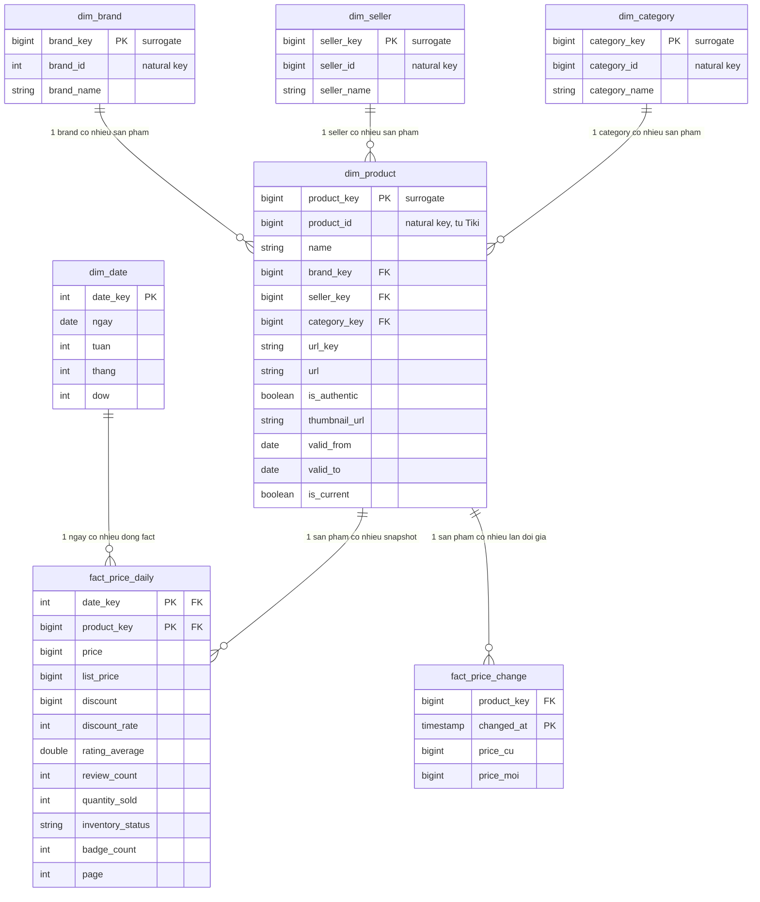

# ERD — Giai đoạn 02

v2: cập nhật theo mô hình mentor đề xuất (surrogate key, SCD2 cho
`dim_product`, tách `dim_brand`/`dim_seller`/`dim_category`, thêm `dim_date`
và `fact_price_change`). Bản gốc 2 bảng (natural key, không SCD2) xem lịch
sử git của file này.

## Thay đổi so với v1 và lý do

- **Surrogate key** (`*_key`, số nguyên tự sinh) thay vì dùng thẳng
  `product_id`/`brand_id`... của Tiki làm khoá chính. Chuẩn thực hành
  dimensional modeling — tách khoá nội bộ (surrogate) khỏi khoá nguồn
  (natural key, vẫn giữ lại làm cột thường để đối chiếu ngược về Tiki), để
  không phụ thuộc vào việc Tiki có đổi cách đánh id hay không.
- **`dim_product` thành SCD Type 2** (`valid_from`, `valid_to`,
  `is_current`) — giải quyết đúng vấn đề đã nêu ở
  [data-model.md](data-model.md) câu 2: nếu 1 `product_id` đổi seller/brand
  giữa các lần crawl, thay vì ghi đè mất lịch sử, sẽ **đóng dòng cũ**
  (`valid_to` = ngày phát hiện đổi, `is_current = false`) và **mở dòng
  mới** (`valid_from` = ngày đó, `is_current = true`).
- **Tách `dim_brand`, `dim_seller`, `dim_category`** khỏi `dim_product` —
  snowflake hoá. v1 từng quyết định không tách vì "chưa có nhu cầu"; giữ
  quyết định đó cho tới khi có lý do cụ thể, nhưng cập nhật theo mô hình
  mentor vì mục tiêu ở giai đoạn này là học đúng bài bản chuẩn, không phải
  tối ưu tốc độ code.
- **`dim_date`** — dimension ngày dựng sẵn (date spine), không sinh ra từ
  dữ liệu crawl mà tạo 1 lần cho một khoảng thời gian dài (VD 5-10 năm).
  Giúp query theo tuần/tháng/thứ mà không phải tính lại từ `crawled_at`
  mỗi lần.
- **`fact_price_change`** — bảng fact "transactional" bổ sung cho
  `fact_price_daily` ("periodic snapshot"): chỉ ghi 1 dòng khi giá thực sự
  đổi so với lần trước, thay vì phải tự diff giữa các snapshot như cách
  làm thủ công lúc trước (so `snap_00` với `snap_06`).

## `dim_seller` giữ tối giản — chưa thêm `logo`/`seller_address`

Khi rà lại toàn bộ response API (`docs/tiki_api_schema.md` mục "khác biệt
field"), phát hiện `filters[code=seller].values[]` trong **listing API**
có sẵn `logo` và `seller_address` (địa chỉ đầy đủ) — dữ liệu này **không
có ở bất kỳ nguồn nào khác**, kể cả API detail. Quyết định: **chưa thêm
2 cột này vào `dim_seller`** vì hiện chưa có nhu cầu phân tích theo
địa lý/logo seller, và việc lấy được nó đòi hỏi sửa `tiki_crawl.py` để
parse thêm phần `filters` (hiện code chỉ đọc `data[]`, chưa đụng tới
`filters`) — thêm trước khi có nhu cầu là làm thừa việc.

Ghi chú lại ở đây để **không mất thông tin đã tìm ra** — nếu sau này cần
`dim_seller` đầy đủ, đây là nơi lấy, không cần dò lại API.

## Việc cần làm khi hiện thực hoá (chưa code, chỉ ghi lại để không quên)

1. **SCD2 cho `dim_product`** và **change-detection cho `fact_price_change`**
   đều cần logic UPSERT/so sánh với dòng "hiện tại" trước khi ghi — pipeline
   hiện tại (`write_bronze`/`write_silver`) chỉ ghi Parquet append-only,
   không đọc lại dữ liệu cũ. Cần thêm bước đọc snapshot gần nhất trước khi
   ghi snapshot mới (dùng DuckDB `UPDATE`/`MERGE` hoặc so sánh bằng pandas).
2. `dim_date` cần script sinh date spine riêng (không phụ thuộc crawl).
3. Giữ nguyên pipeline crawl hiện tại (`tiki_crawl.py`) không đổi — ERD này
   là lớp xử lý *sau* Bronze/Silver, không ảnh hưởng cách crawl.
